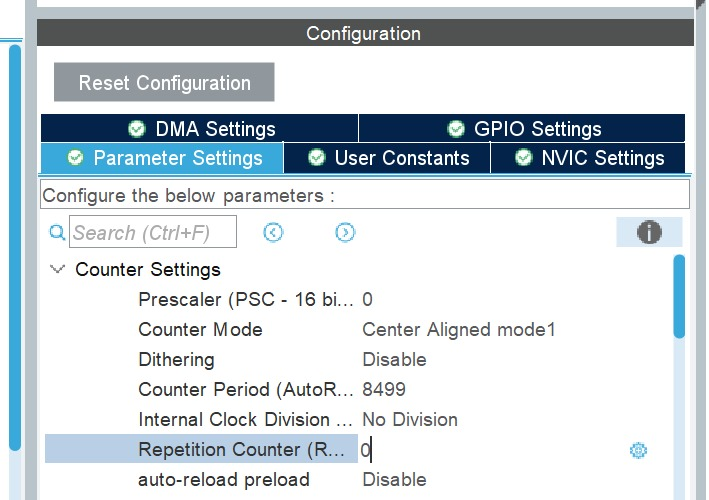
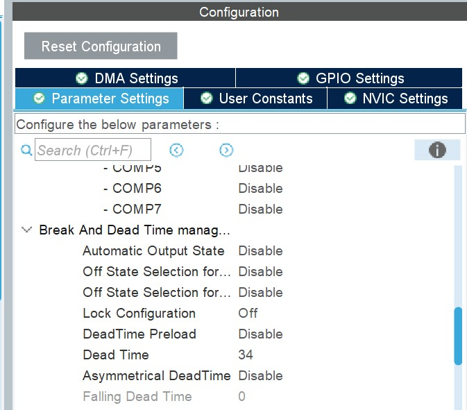
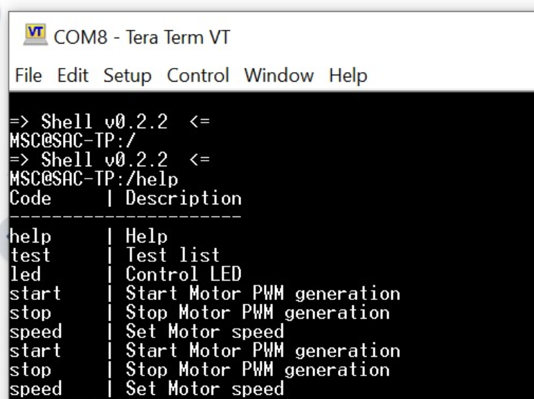
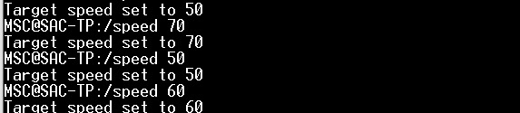
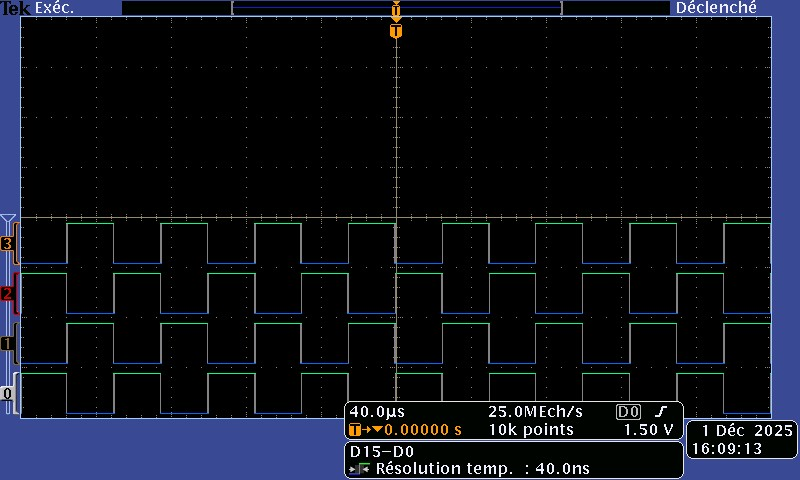
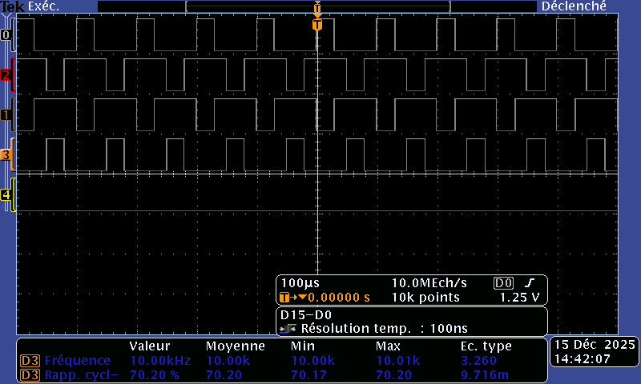
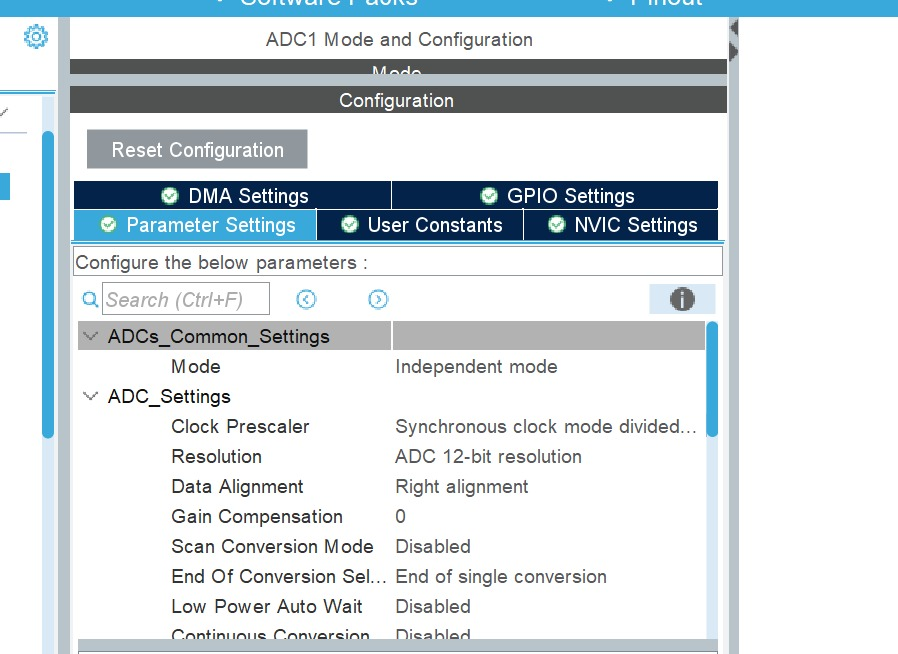
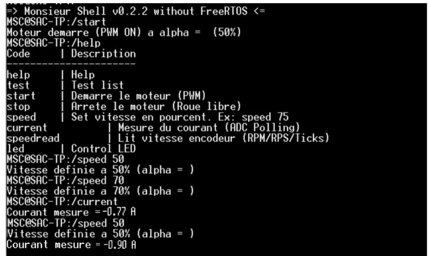

## 1. Objectifs du TP

Ce TP a pour objectif la mise en œuvre d’une commande en boucle ouverte d’une machine à courant continu (MCC) à l’aide d’un microcontrôleur STM32.
La commande repose sur la génération de PWM complémentaires avec temps mort, pilotées via une interface shell UART, permettant de contrôler la vitesse du moteur et d’observer son comportement expérimentalement.

## 2. Génération des PWM complémentaires (Commande MCC basique)

### 2.1 Configuration du timer

La génération des PWM est réalisée à l’aide d’un timer avancé configuré en :

Ce mode permet une génération symétrique des fronts montants et descendants, adaptée au pilotage d’un pont de puissance.

### 2.2 Insertion du temps mort

Afin d’éviter tout court-circuit dans le pont de puissance, un temps mort est inséré entre les signaux complémentaires.

Horloge timer : 170 MHz  → période : 5.88 ns = 1 tic
Dead-time souhaité : 200 ns
Alors: `DTG = 200ns / 5.88ns ≈ 34`

Alors pour la configuration : Dead Time : 34

Affichage sur oscilloscope: 
Générer quatre PWM sur les bras de pont U et V pour controler le hacheur à partir du timer déjà attribué sur ces pins.

Pour les tests, on a fixé le rapport cyclique à 60% 

## 3. Interface Shell UART

Une interface shell est mise en place via l’UART, permettant de commander le moteur en temps réel sans modifier le code.
La commande help permet d’afficher les commandes disponibles :

## 4. Commande de vitesse du moteur
### 4.1 Principe

La vitesse du moteur est commandée via la commande :  `speed XX `

où XX représente un pourcentage du rapport cyclique maximal.
La valeur est vérifiée afin de rester dans la plage autorisée (0–100).

### 4.2 Tests pour différentes consignes

Des essais ont été réalisés pour plusieurs valeurs de vitesse :

- speed 50
- speed 60
- speed 70

À chaque changement de consigne, la nouvelle valeur est correctement interprétée par le shell et appliquée au moteur.

### 4.3 Observation à l’oscilloscope

Les signaux PWM ont été observés à l’oscilloscope pour chaque consigne :

À 50 %, le fonctionnement est stable.

À 60 %, la variation du rapport cyclique est clairement visible.

À 70 %, une montée plus brusque est observée, illustrant l’augmentation de l’énergie fournie au moteur.

### 4.4 Test à fort rapport cyclique (70 %)

Un test supplémentaire a été réalisé avec un rapport cyclique de 70 %, appliqué directement après une consigne plus faible.

Lors du passage direct de 50 % à 70 % de rapport cyclique, une montée brusque du régime moteur est observée.  
Cette variation rapide s’accompagne d’une augmentation significative du courant, visible sur les mesures à l’oscilloscope.

Ce comportement met en évidence un risque potentiel d’endommagement :
- du moteur, de l’électronique de puissance, et de la chaîne d’acquisition.

Cette observation justifie la mise en place, dans la suite du TP, d’une rampe progressive du rapport cyclique afin de limiter l’appel de courant.

## 7. Mesure du courant moteur

### 7.1 Choix des courants à mesurer

Dans le cas d’une machine à courant continu (MCC) pilotée par un pont en H,  
le courant le plus pertinent à mesurer est le courant moteur, car il est directement lié au couple électromagnétique et permet d’assurer la protection du système.

Dans notre montage :
- la MCC est connectée entre les phases U et V,
- la mesure du courant de phase est suffisante pour analyser le comportement du moteur et surveiller son fonctionnement.

En complément, le courant du bus d’alimentation (Ibus) peut également être mesuré afin d’assurer une supervision globale de la puissance consommée et de détecter d’éventuelles surcharges.

### 7.2 Capteur de courant et fonction de transfert

Les capteurs de courant utilisés délivrent une tension analogique proportionnelle
au courant mesuré, centrée autour d’une tension d’offset.

D’après la datasheet du capteur :

- **Tension d’offset** : V_offset = 1.65 V

- **Sensibilité** : S = 50 mV/A

La relation entre la tension de sortie du capteur et le courant mesuré est :

I_mesuré = (V_out − V_offset) / S

### 7.3 Première mesure du courant avec l’ADC (Polling)
#### 7.3.1 Configuration de l’ADC

Pour une première validation de la chaîne de mesure, l’ADC du STM32 est utilisé en mode Polling, sans DMA.

La configuration retenue est la suivante :

### 7.3.2 Principe de mesure en Polling

Le principe de mesure est le suivant :

1. Démarrer l’ADC.
2. Attendre la fin de conversion (`HAL_ADC_PollForConversion`).
3. Lire la valeur brute de l’ADC.
4. Convertir cette valeur en courant à l’aide de la fonction de transfert.

Calcul du courant à l’aide de la fonction de transfert du capteur, la formule utilisée dans le code est :

- I = ((ADC_value / 4096) × 3.3 − 1.65) / 0.05

- **Affichage sur le terminal** :
  

  

